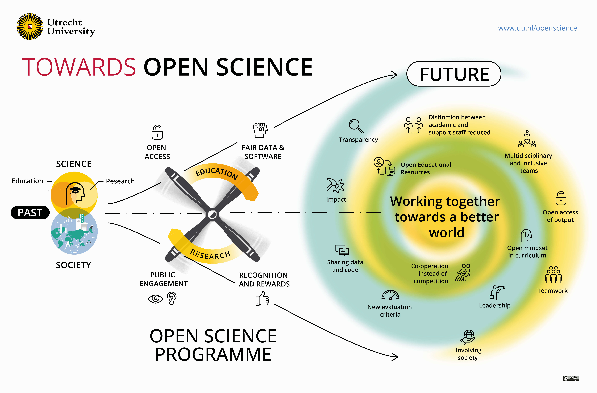

# Open Science Monitor 

Information and mock data repository for Utrecht University's Open Science Monitor.

---

## Background and pre-registration

This project was started by the Open Science Programme of Utrecht University. With the Open Science Monitor, the university aims to gain insight into what can be done to facilitate and support Open Science among academics at Utrecht University and University Medical Center Utrecht. The survey contains questions about awareness, attitudes and behaviors regarding several Open Science practices, as well as questions about the opportunities and barriers in carrying out those practices.

The pre-registration and report for the Open Science Monitor 2020 can be found on <a href="https://doi.org/10.5281/zenodo.5725177">Zenodo</a> (pre-registration DOI: 10.5281/zenodo.5727107; report DOI: 10.5281/zenodo.5725178).

The pre-registration of the Open Science Monitor 2022 can be found on <a href="https://aspredicted.org/f5b9j.pdf">AsPredicted</a>.

## Data use

The Open Science Monitor is licensed under a <a rel="license" href="http://creativecommons.org/licenses/by/4.0/">Creative Commons Attribution 4.0 International License</a>. The respondent data is stored and documented on Utrecht University's research data management service <a href="https://www.uu.nl/en/research/yoda">YODA</a>, but cannot be shared publicly. Therefore, mock data is made available for the Open Science Monitor 2022, see [the Contents section below](#contents).

## Analysis requests

The main analyses of the Open Science Monitor 2022 have been performed using SPSS (v.28). The corresponding syntax files can be found in the Analyses folder, see [the Contents section below](#contents).
 
If you would like to suggest secondary analyses for the Open Science Monitor 2022 data, please develop an analysis pipeline or syntax file that is compatible with the mock data in this repository. The mock data and codebooks can be found in the Data folder, see [the Contents section below](#contents). Preferably, use `R` or `SPSS` in these analysis requests.

Data analysis requests can be made through <a href="https://github.com/UtrechtUniversity/OpenScienceMonitor/issues">GitHub Issues</a>. 

## Contents

This repository is structured as follows:

| **Folders** |          |               | **Contents**                                             |
|-------------|----------|---------------|----------------------------------------------------------|
| img         |          |               | _Images_                                                 |
| 2022        |          |               |                                                          |
|             | Analyses |               |                                                          |
|             |          | OBP analyses  | _Analysis syntax (support staff survey)_                 |
|             |          | WP analyses   | _Analysis syntax (academic personnel survey)_            |
|             | Data     |               |                                                          |
|             |          | OBP codebook  | _Data description (support staff survey)_                |
|             |          | OBP mock data | _Data for analysis requests (support staff survey)_      |
|             |          | WP codebook   | _Data description (academic personnel survey)_           |
|             |          | WP mock data  | _Data for analysis requests (academic personnel survey)_ |
|             |          |               |                                                          |

---

